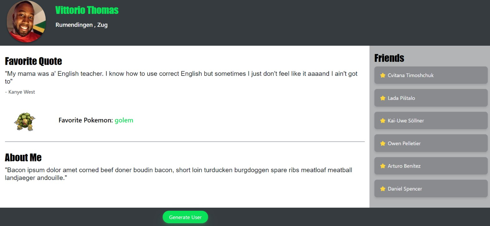

##  📍 Random User Page Generator
The Random User Page Generator project is a web application that leverages four distinct APIs to dynamically generate a unique and entertaining webpage. The project incorporates the Random User Generator API to fetch data for a main user and six friends, including their names and profile pictures. The Random Kanye Quote Generator API contributes a touch of Kanye West's wisdom with a randomly generated quote. Utilizing the PokeAPI, the project fetches information about a random Pokémon, showcasing its image and name. Finally, the Bacon Ipsum API provides flavorful text for the "About Me" section at the bottom of the page. The result is a playful and diverse webpage that combines user profiles, celebrity quotes, Pokémon details, and meat-themed text, offering an engaging and entertaining user experience.

## 〰️APIs Used
1. [Random User Generator API](https://randomuser.me/api/?format=json)
2. [Random Kanye Quote Generator API](https://kanye.rest/)
3. [PokeAPI](https://pokeapi.co/docs/v2)
4. [Bacon Ipsum AP](https://baconipsum.com/api/?type=all-meat&sentences=1&start-with-lorem=1)

## 〰️Screenshot

